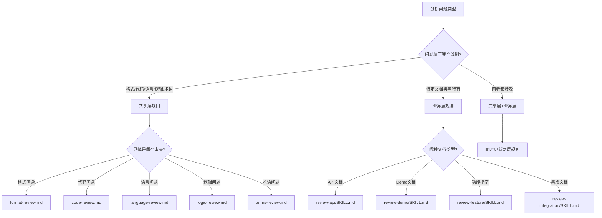

# 规则更新指南 Skill

## When to Use
- 用户在对话中指出审查报告的问题（漏报、误报、描述不准确等）
- 需要根据反馈更新审查规则时

## Instructions

**⚠️ 核心原则**
- **用户确认优先**：任何规则修改都必须经过用户明确确认
- **影响范围清晰**：必须明确说明规则修改会影响哪些文档类型
- **可追溯性**：所有变更都要记录到 CHANGELOG.md
- **保守修改**：只修改必要的部分，避免过度调整

---

## 工作流程

### Step 1：分析用户反馈

当用户指出问题时，首先分析反馈内容，确定问题类型。

**问题类型分类**：

1. **漏报问题**：应该发现但未发现的问题
   - 示例："步骤4提到会收到通知，但没说具体是哪个回调"
   - 处理方式：加强检查规则，新增检查项

2. **误报问题**：不应标记但被标记为问题
   - 示例："参数表在代码后面也算有说明，不应标记为缺失"
   - 处理方式：添加排除规则或明确边界条件

3. **描述不准确**：问题存在但描述或建议有误
   - 示例："建议不够具体，应该给出更明确的修改方案"
   - 处理方式：优化规则的输出格式或描述模板

4. **优先级不当**：问题的严重程度判断有误
   - 示例："这不影响功能使用，不应标记为 P0"
   - 处理方式：调整优先级判断标准

**分析方法**：
```
1. 仔细阅读用户的反馈
2. 定位到具体的报告问题或遗漏的问题
3. 理解用户的期望是什么
4. 确定问题根源在哪个审查规则
```

---

### Step 2：确定影响范围

根据问题类型，判断需要修改哪个层级的规则。

**影响范围判断树**：



**具体判断标准**：

| 问题特征 | 影响范围 | 修改文件 |
|---------|---------|---------|
| 所有文档都应检查的问题 | 共享层 | `skills/_shared/*.md` |
| 只在特定文档类型出现 | 业务层 | `skills/review-*/SKILL.md` |
| 通用规则在特定场景的细化 | 共享层+业务层 | 两者都修改 |
| 报告生成格式问题 | 共享层 | `generate-review-report/SKILL.md` |
| 全局流程问题 | 全局层 | `.cursorrules` |

---

### Step 3：定位规则文件和章节

准确找到需要修改的规则位置。

**定位策略**：

1. **根据问题类型快速定位文件**：
   - 空格、代码块格式 → `format-review.md`
   - API 拼写、语法错误 → `code-review.md`
   - 口语化、标题规范 → `language-review.md`
   - 步骤遗漏、信息缺失 → `logic-review.md`
   - 术语一致性 → `terms-review.md`

2. **在文件内定位到具体章节**：
   - 使用 grep 搜索关键词
   - 查看文件的"审查规则"或"检查项"章节
   - 找到最相关的检查项

3. **确定修改位置**：
   - 新增检查项：添加到现有检查项列表
   - 修改判断标准：更新具体的检查逻辑
   - 添加排除规则：在"不检查的情况"中补充

**示例**：
```
用户反馈："离开房间时未说明具体回调事件名称"

定位过程：
1. 问题类型：信息缺失（未说明回调名称）
2. 影响范围：共享层（所有文档都应检查）
3. 目标文件：logic-review.md
4. 具体章节：## 2. 信息缺失
5. 修改方式：在"警告"级别检查项中新增一条
```

---

### Step 4：生成规则变更 diff

生成清晰的规则对比，展示给用户确认。

**diff 生成格式**：

```markdown
## 规则更新建议

### 📋 基本信息
**触发原因**: [用户反馈的原话]  
**问题分类**: 漏报 / 误报 / 描述不准确 / 优先级不当  
**影响范围**: 共享层 / 业务层 / 全局层  

### 📂 涉及文件
- `skills/_shared/logic-review.md`

### 📊 影响评估
- **影响文档类型**: 所有文档类型（功能指南、API文档、Demo文档、集成文档）
- **影响审查环节**: Step 2 - 共享层审查中的逻辑审查
- **预期效果**: 后续审查将检测到类似问题，避免漏报

### 🔄 变更内容

#### 文件：skills/_shared/logic-review.md

```diff
--- skills/_shared/logic-review.md (原规则)
+++ skills/_shared/logic-review.md (新规则)
@@ -15,6 +15,10 @@
 ## 2. 信息缺失
 检查承诺的内容是否兑现：
 - **严重**: 前文明确承诺会介绍某功能/步骤，或标题承诺的核心内容，但后文完全没有相关内容（影响用户完成任务）
 - **警告**: 引用缺失，如提到"详见 XXX"但未提供链接（用户需要额外查找）
 - **警告**: 功能描述不完整，如只说"支持 A、B、C 功能"但未展开说明（不影响当前文档主线）
+- **警告**: 提及事件通知时未说明具体回调方法名称
+  - **检查场景**: 当文档提到"会收到通知"、"会触发事件"等表述时
+  - **要求**: 必须明确说明具体的回调方法名称（如 `onUserLeft`、`onRoomEnded` 等）
+  - **示例**: "参与者会收到通知" → 应改为 "参与者会收到通知（通过 `onUserLeft` 回调接收）"
+  - **原因**: 避免开发者不知道该监听哪个事件
```

### ✅ 确认问题
请确认以下内容：
1. 变更内容是否准确理解了您的反馈？
2. 影响范围是否合理？
3. 是否需要同时修改其他相关规则？

**请回复 "确认" 以应用此更新，或提出修改意见。**
```

**diff 生成要点**：
- 使用标准的 diff 格式（`---`、`+++`、`@@`）
- 保留足够的上下文（前后各 3-5 行）
- 用 `-` 标记删除的行，`+` 标记新增的行
- 清晰说明为什么要这样改

---

### Step 5：等待用户确认

展示 diff 后，等待用户回复。

**可能的用户回复**：

1. **"确认"**、**"同意"**、**"可以"** → 执行 Step 6
2. **提出修改意见** → 调整规则，重新生成 diff
3. **"取消"**、**"不需要"** → 终止流程
4. **询问细节** → 解答疑问，等待确认

**注意事项**：
- 不要在用户未确认的情况下修改规则
- 如果用户提出修改意见，认真理解并调整
- 确保用户完全理解变更的影响范围

---

### Step 6：应用规则更新

用户确认后，执行以下操作：

**操作步骤**：

1. **更新规则文件**：
   - 使用 `search_replace` 工具精确修改规则文件
   - 确保修改内容与 diff 完全一致
   - 保持文件格式和缩进不变

2. **更新 CHANGELOG.md**：
   - 在文件开头添加新的变更记录
   - 使用当前日期（YYYY-MM-DD 格式）
   - 包含完整的变更信息

3. **反馈完成信息**：
   - 告知用户规则已更新
   - 说明更新了哪些文件
   - 询问是否需要用新规则重新审查当前文档

**CHANGELOG 记录格式**：
```markdown
## YYYY-MM-DD

### [变更类型] 影响层级 - 文件路径
**原因**: [用户反馈的问题描述]  
**影响**: [说明影响范围]  
**变更**: [简要说明具体修改内容]
```

**完成反馈模板**：
```markdown
✅ 规则更新完成

**已更新的文件**：
- `skills/_shared/logic-review.md`

**变更已记录到**：
- `CHANGELOG.md`

**后续建议**：
是否需要使用更新后的规则重新审查当前文档？这样可以验证新规则是否能正确检测到之前遗漏的问题。
```

---

## 规则更新场景示例

### 场景 1：用户指出漏报

**用户反馈**：
> "步骤4提到其他参与者会收到通知，但没说具体是哪个回调"

**处理流程**：
1. 分析：属于"信息缺失"问题，影响共享层 logic-review.md
2. 定位：logic-review.md 的"信息缺失"章节
3. 生成 diff：在检查项中新增"提及事件通知时未说明回调方法名称"
4. 等待确认
5. 应用更新
6. 记录到 CHANGELOG

---

### 场景 2：用户指出误报

**用户反馈**：
> "参数表在代码示例后面也是有说明的，不应该标记为缺失"

**处理流程**：
1. 分析：属于误报，检查规则过于严格
2. 定位：review-feature/SKILL.md 的"参数与配置可落地性检查"
3. 生成 diff：在"强制跳过检查的情况"中明确说明参数可以在代码后
4. 等待确认
5. 应用更新
6. 记录到 CHANGELOG

---

### 场景 3：用户指出描述不准确

**用户反馈**：
> "问题描述太模糊了，应该给出更具体的修改建议"

**处理流程**：
1. 分析：属于报告质量问题
2. 定位：generate-review-report/SKILL.md 的输出格式要求
3. 生成 diff：强化"修改建议必须具体可操作"的要求
4. 等待确认
5. 应用更新
6. 记录到 CHANGELOG

---

## 注意事项

### 规则修改的原则

1. **最小化修改**：只修改必要的部分，不要过度调整
2. **保持一致性**：新规则的风格和格式要与现有规则一致
3. **明确边界**：清楚说明什么情况下应用规则，什么情况下不应用
4. **可验证性**：规则应该能够被执行和验证，不要模糊不清

### 避免的错误

1. ❌ 未经用户确认就修改规则
2. ❌ 修改内容与 diff 不一致
3. ❌ 忘记更新 CHANGELOG
4. ❌ 影响范围评估错误（该改业务层却改了共享层）
5. ❌ 规则表述模糊，难以执行

### 质量保证

在应用更新前，自检以下内容：
- [ ] 规则修改准确理解了用户反馈
- [ ] 影响范围判断正确
- [ ] diff 格式规范、易读
- [ ] CHANGELOG 记录完整
- [ ] 用户已明确确认

---

## Output Format

本 Skill 的输出是对话式的，不生成单独的文件。输出内容包括：

1. **规则更新建议**（Markdown 格式，包含 diff）
2. **确认请求**（等待用户回复）
3. **更新完成反馈**（说明已更新的文件和后续建议）

所有输出都应清晰、友好、易于理解。
